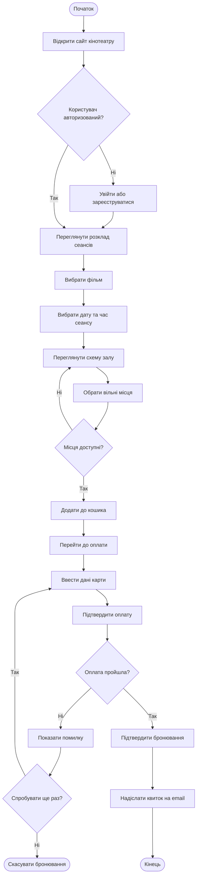

# Activity Diagram — Процес купівлі квитка в кінотеатрі

## Опис

Діаграма відображає повний процес купівлі квитка:

1. Перевірка авторизації користувача
2. Вибір фільму, дати та місць
3. Перевірка доступності обраних місць
4. Оплата з можливістю повторної спроби
5. Підтвердження та надсилання квитка на email
