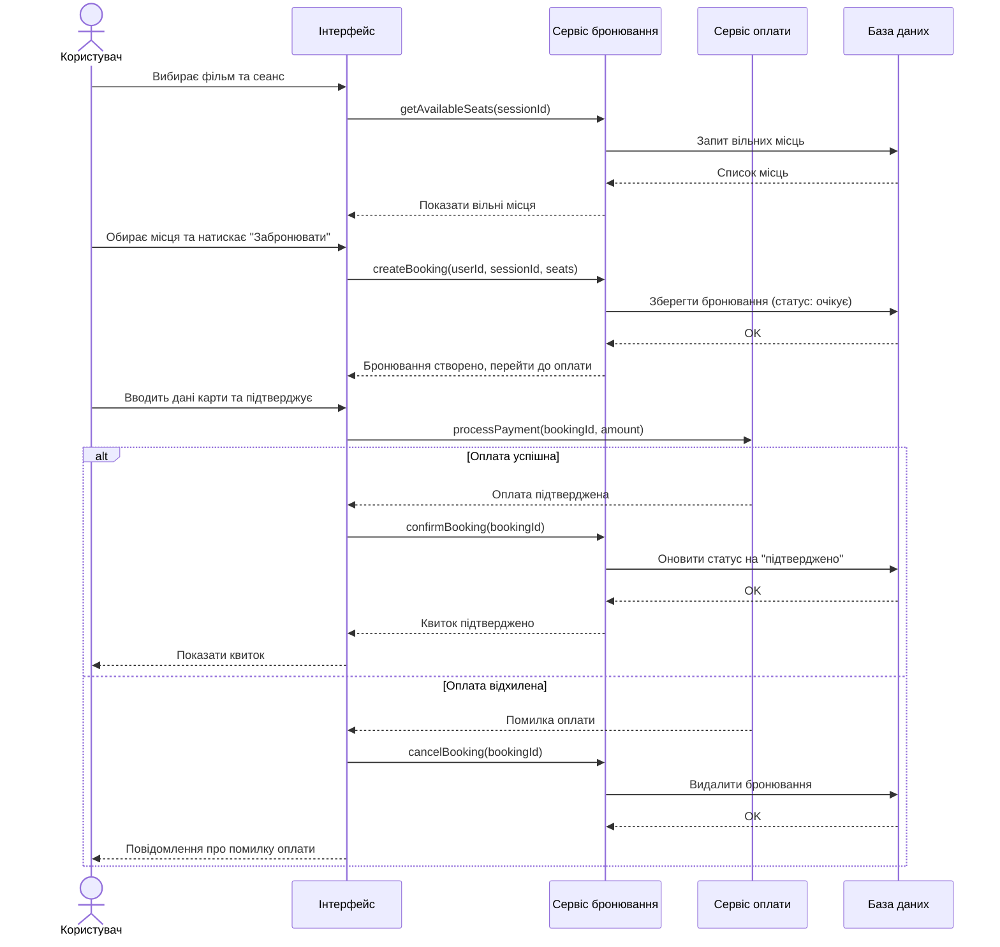

# Sequence Diagram — Бронювання квитка в кінотеатрі

## Опис

Діаграма показує процес бронювання квитка:

1. Користувач обирає фільм і переглядає вільні місця
2. Система створює попереднє бронювання
3. Користувач здійснює оплату
4. При успішній оплаті — квиток підтверджується
5. При невдалій оплаті — бронювання скасовується автоматично
