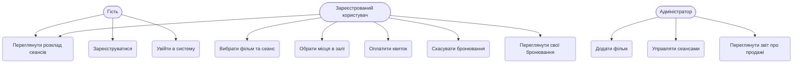

# Use Case Diagram — Система бронювання квитків у кінотеатр

## Опис

Система бронювання квитків має три типи акторів:

- **Гість** — може переглядати розклад, реєструватися та входити в систему
- **Зареєстрований користувач** — може бронювати квитки, обирати місця, оплачувати та скасовувати бронювання
- **Адміністратор** — керує фільмами, сеансами та переглядає статистику продажів
